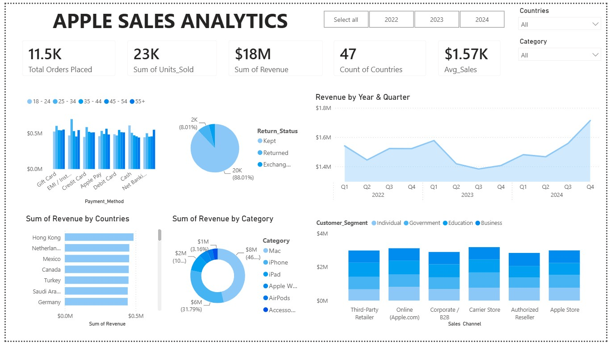

# apple-sales-analysis
Interactive sales analytics project exploring Apple global sales trends using Excel, SQL, Power BI, and Python.
# Apple Global Sales Analytics Dashboard

## Overview
This project presents an end-to-end data analytics workflow using Apple's global sales dataset (2022–2024). The objective was to transform raw sales data into meaningful business insights by applying data cleaning, exploratory analysis, SQL querying, dashboard development, and Python-based analysis.

The project analyzes sales performance across products, countries, continents, customer segments, and age groups to identify key trends and support data-driven decision making.

---

## Objectives
- Clean and prepare raw sales data for analysis.
- Analyze sales performance across multiple business dimensions.
- Answer business questions using SQL.
- Build an interactive Power BI dashboard.
- Perform exploratory data analysis using Python.

---

## Tools & Technologies
- **Microsoft Excel** – Data cleaning, preprocessing, Pivot Tables, Charts
- **MySQL** – SQL queries and business analysis
- **Power BI** – Interactive dashboard and KPI visualization
- **Python** – Pandas, NumPy, Matplotlib
- **Git & GitHub** – Version control and project hosting

---

## Project Workflow

### 1. Data Cleaning (Excel)
- Cleaned and organized the dataset.
- Handled missing and inconsistent values.
- Standardized data for further analysis.

### 2. Exploratory Data Analysis (Excel)
- Created Pivot Tables and charts.
- Analyzed sales trends across:
  - Products
  - Continents
  - Countries
  - Customer Segments
  - Age Groups

### 3. SQL Analysis (MySQL)
- Wrote SQL queries to answer business questions.
- Performed aggregations, filtering, sorting, and grouping.
- Generated insights from sales data.

### 4. Dashboard Development (Power BI)
Developed an interactive dashboard featuring:
- Sales KPIs
- Product-wise sales analysis
- Regional performance
- Customer segment analysis
- Age group distribution
- Interactive filters and slicers

### 5. Python Analysis
Used Python libraries to perform additional analysis and data manipulation.
- Pandas
- NumPy
- Matplotlib

---

## Business Insights
The project helps answer questions such as:
- Which products generated the highest sales?
- Which regions contributed the most revenue?
- Which customer segments were most profitable?
- How do purchasing patterns vary across age groups?
- Which markets showed the strongest sales performance?

---

## Repository Structure

```
Apple-Global-Sales-Analytics
│
├── Data/
│   └── Apple_Global_Sales.xlsx
│
├── SQL/
│   └── SQL_Queries.sql
│
├── PowerBI/
│   └── Apple_Sales_Dashboard.pbix
│
├── Python/
│   └── Analysis.ipynb
│
├── Images/
│   └── Dashboard.png
│
└── README.md
```

---

## Dashboard Preview


---

## Skills Demonstrated
- Data Cleaning
- Data Wrangling
- Exploratory Data Analysis (EDA)
- SQL Querying
- Dashboard Development
- Data Visualization
- Business Intelligence
- Python for Data Analysis

---

## Future Improvements
- Add advanced statistical analysis.
- Build sales forecasting models.
- Include customer lifetime value analysis.
- Automate data processing using Python.

---

## Author

**Bhumika Rana**

- LinkedIn: https://linkedin.com/in/bhumikarana92539b3b2/
- GitHub: https://github.com/bhumikarana23
